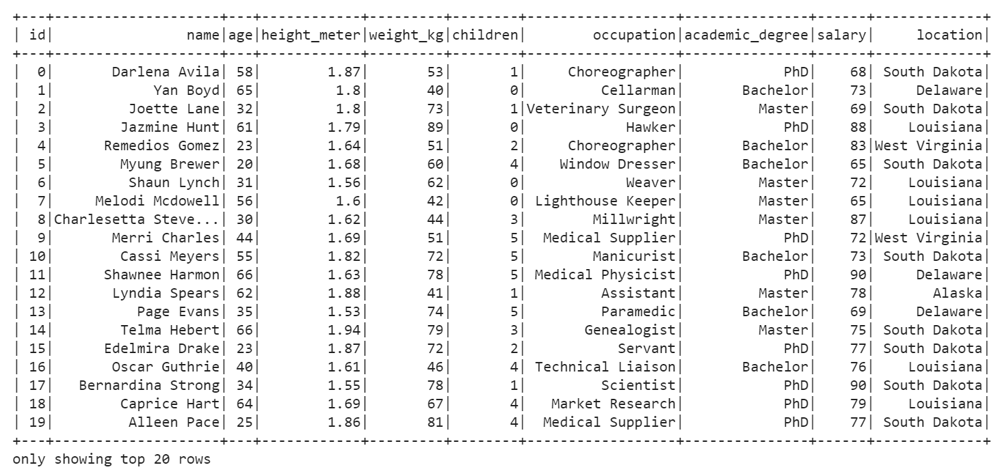

### Big Data

* [Colab Notebooks](https://drive.google.com/drive/folders/17WSgL3VvCGy5nNHSmLAQnycroozmEBND)

```
# Start Spark session
from pyspark.sql import SparkSession
spark = SparkSession.builder.appName("Demographics").getOrCreate()

# Read in data from S3 Buckets
from pyspark import SparkFiles
url = "https://s3.amazonaws.com/dataviz-curriculum/day_1/demographics.csv"
spark.sparkContext.addFile(url)
df = spark.read.csv(SparkFiles.get("demographics.csv"), sep=",", header=True)

# Show DataFrame
df.show()
```

 
